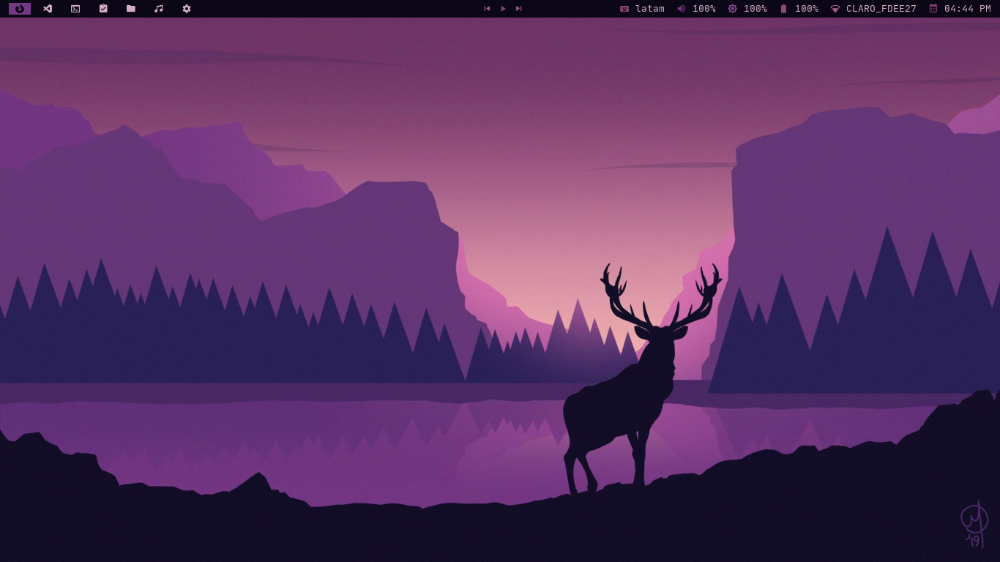
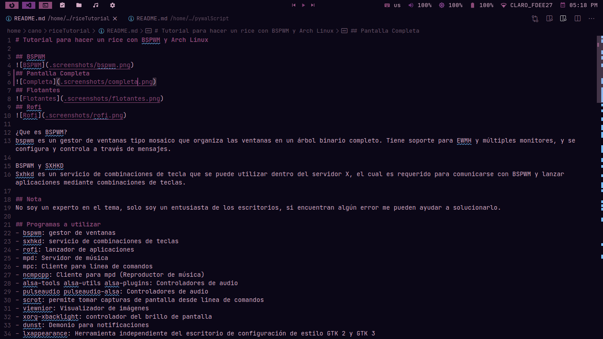
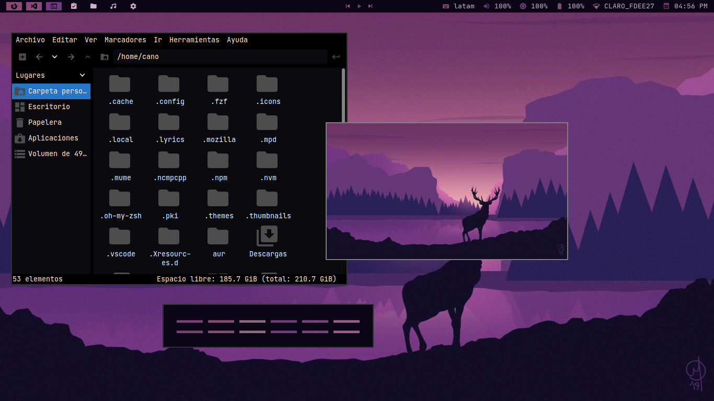
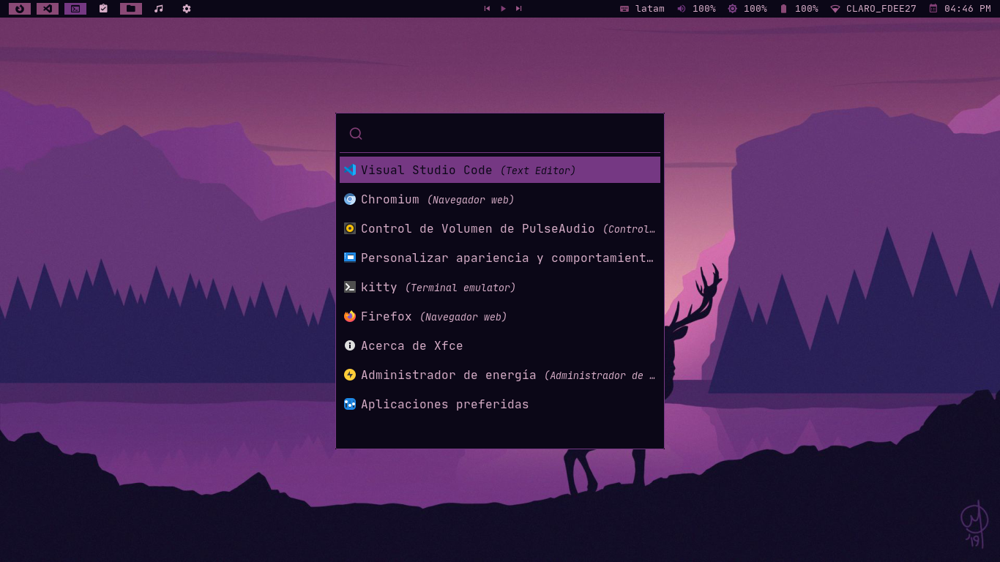
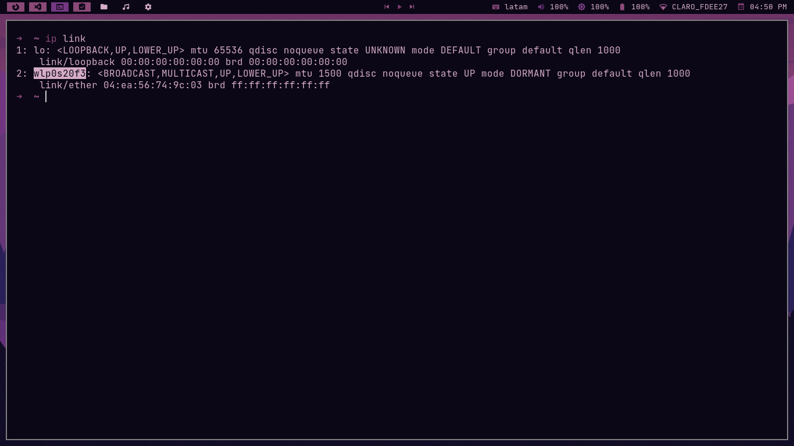
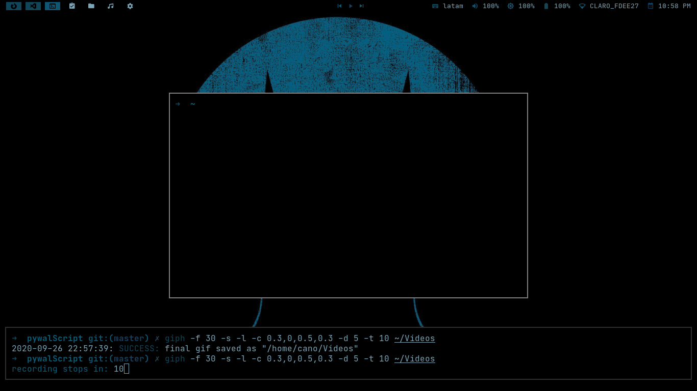

# Tutorial para hacer un rice con BSPWM y Arch Linux 

## BSPWM
  
## Pantalla Completa
  
## Flotantes
  
## Rofi
  

¿Que es BSPWM?
bspwm es un gestor de ventanas tipo mosaico que organiza las ventanas en un árbol binario completo. Tiene soporte para EWMH y múltiples monitores, y se configura y controla a través de mensajes. 

BSPWM y SXHKD 
Sxhkd es un servicio de combinaciones de tecla que se puede utilizar dentro del servidor X, el cual es requerido para comunicarse con BSPWM y lanzar aplicaciones mediante combinaciones de teclas.

## Nota
No soy un experto en el tema, solo soy un entusiasta de los escritorios, si encuentran algún error me pueden ayudar a solucionarlo.

## Programas a utilizar  
- bspwm: gestor de ventanas  
- sxhkd: servicio de combinaciones de teclas  
- rofi: lanzador de aplicaciones 
- mpd: Servidor de música  
- mpc: Cliente para línea de comandos 
- ncmpcpp: Cliente para mpd (Reproductor de música) 
- alsa-tools alsa-utils alsa-plugins: Controladores de audio  
- pulseaudio pulseaudio-alsa: Controladores de audio  
- scrot: permite tomar capturas de pantalla desde linea de comandos  
- viewnior: Visualizador de imágenes 
- xorg-xbacklight: controlador del brillo de pantalla   
- dunst: Demonio para notificaciones 
- lxappearance: Herramienta independiente del escritorio de configuración de estilo GTK 2 y GTK 3 
- nm-connection-editor: Editor de conexiones de red 
- papirus-icon-theme: Iconos 
- feh: Gestor de fondos de pantalla 
- ffmpeg: es una solución multiplataforma completa para grabar, convertir y transmitir audio y video 
- ffmpegthumbnailer: Miniatura de video liviana que pueden usar los administradores de archivos 
- imagemagick: es una suite de software gratuito y de código abierto para mostrar, convertir y editar archivos de imágenes 
- xfce4-power-manager: Administración de energía 
- kitty: es un emulador de terminal basado en OpenGL programable con TrueColor, soporte de ligaduras, extensiones de protocolo para entrada de teclado y renderizado de imágenes. También ofrece capacidades de mosaico 
- pcmanfm: Administrador de archivos 
- jq: Procesador JSON de línea de comandos 
- yay: Gestor de paquete AUR 
- networkmanager-dmenu: Gestor de redes wifi con rofi 
- betterlockscreen: Bloqueador de Pantalla  
- kunst: kunst es un demonio que extrae la carátula del álbum de las canciones que se reproducen en mpd 

## Polybar WIFI 
No aparece tu red en polybar, se soluciona de la siguiente manera: Primero abre una terminal y ejecuta el comando ip link 
 copia el resultado y lo pegas en el archivo de configuración de polybar en la ruta ~/.config/polybar/config, en la linea 417 donde dice interface.

# Instalaciones  
```
sudo pacman -S bspwm sxhkd rofi mpd mpc ncmpcpp alsa-tools alsa-utils alsa-plugins\
pulseaudio pulseaudio-alsa scrot viewnior xorg-xbacklight dunst lxappearance\
nm-connection-editor papirus-icon-theme feh ffmpeg ffmpegthumbnailer\
imagemagick xfce4-power-manager kitty pcmanfm jq
```
```
git clone https://aur.archlinux.org/polybar.git  
cd polybar  
makepkg -si 
``` 
```
yay -S networkmanager-dmenu-git betterlockscreen-git kunst-git 
```  
## Copiar Configuraciones  
``` 
git clone https://github.com/PAC97/dotfilesBlack.git 
cd dotfilesBlack  
cp -r .config/* ~/.config  
sudo cp -r fonts/* /usr/share/fonts   
sudo cp bin/* /usr/local/bin  
cp -r .Xresources.d ~/  
cp .Xresources ~/  
cp .fehbg ~/  
cp -r .mpd ~/  
cp -r .ncmpcpp ~/  
cp -r .themes ~/  
cp -r .icons ~/  
```  

## Generador de esquema de colores según la imagen seleccionada 
  

## Instalar Pywal    
```
sudo pip3 install pywal
```
## Instalación  
```
git clone https://github.com/PAC97/pywalScript.git  
cd pywalScript  
chmod +777 pywalScript  
sudo mv pywalScript /usr/local/bin  
```

## Uso  
```
En tu terminal escribe el siguiente comando:  
pywalScript -i ruta de la imagen  

Ejemplo
pywalScript -i /home/pan/Imágenes/dark.jpg
```
## Combinaciones de Teclas
##### Para agregar tus propias combinaciones de teclas debes editar el archivo ~/.config/sxhkd/sxhkdrc
- windows + enter: kitty (terminal) en el escritorio 3
- windows + shift + enter: kitty (terminal) en modo flotante
- windows + d: rofi launcher 
- windows + n: network-manager
- windows + b: firefox
- windows + shift + f: pcmanfm
- windows + shift + g: geany 
- windows + space: modo flotante/modo fijo
- windows + w: cerrar aplicación
- windows + shift + x: power menu
- windows + shift + m: Controles de música
- windows + ctrl + arriba/abajo/izq/der: ampliar la ventana cuando esta flotante
- windows + alt + arriba/abajo/izq/der: reducir la ventana cuando esta flotante 
- ctrl + shift + arriba/abajo/izq/der: mover la ventana cuando esta en modo flotante
- ctrl + alt + l: Bloquear Pantalla